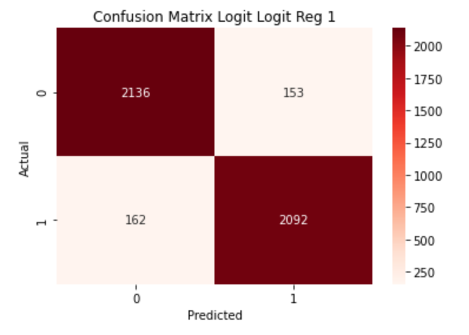
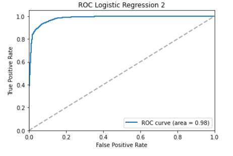
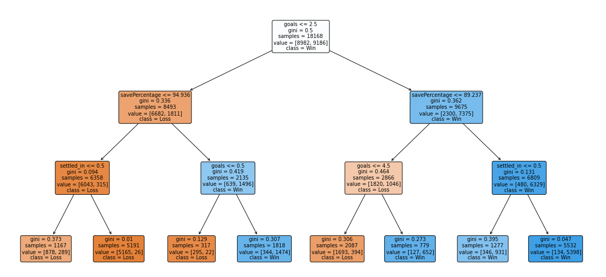

# Hockey Player Analysis

## About
This project analyzes hockey player statistics to uncover insights into player performance, game trends, and key metrics affecting success. The analysis involves data manipulation, visualization, and statistical techniques using Python.

---

## Objectives
- **Performance Evaluation**:
  - Assess individual player performance using advanced metrics.
- **Trend Analysis**:
  - Identify game trends and their impact on player contributions.
- **Data Insights**:
  - Explore relationships between key variables like scoring, assists, and time on ice.
  - 
---

## Visualizations
###Confusion Matrix
  
###ROC Curve
  
###Decision Tree
  

---

## Features
- **Exploratory Data Analysis**:
  - Summary statistics for player performance metrics.
  - Correlation analysis between variables.
- **Data Visualization**:
  - Line plots, scatter plots, and heatmaps to reveal patterns and trends.
- **Statistical Analysis**:
  - Regression models to understand factors influencing player success.

---

## Tools & Technologies
- **Programming Language**: Python
- **Libraries**:
  - Data manipulation: `pandas`, `numpy`
  - Visualization: `matplotlib`, `seaborn`
  - Statistical modeling: `statsmodels`, `scipy`
  - Jupyter Notebook for an interactive environment.

---

## Key Code Snippets

### 1. Summary Statistics
```python
# Display summary statistics for key metrics
data.describe()
```

### 2. Correlation Heatmap
```python
import seaborn as sns
import matplotlib.pyplot as plt

# Plot correlation heatmap
correlation_matrix = data.corr()
sns.heatmap(correlation_matrix, annot=True, cmap='coolwarm')
plt.title("Correlation Heatmap")
plt.show()
```

### 3. Regression Analysis
```python
import statsmodels.api as sm

X = data[['Goals', 'Assists', 'TimeOnIce']]
y = data['Points']
X = sm.add_constant(X)
model = sm.OLS(y, X).fit()
print(model.summary())
```

---

## Results
- **Key Findings**:
  - Strong positive correlation between time on ice and player points.
  - Assists have a significant impact on total points scored.
  - Identified clusters of high-performing players using advanced metrics.
- **Insights**:
  - Players with higher ice time contribute significantly to team performance.
  - The balance between goals and assists is crucial for sustained success.


---

## Limitations
1. **Data Availability**:
   - Analysis limited by the scope and quality of available player data.
2. **Complex Interactions**:
   - Simple models may not capture all interactions between variables.
3. **Generalizability**:
   - Findings may not apply to all leagues or player categories.

---

## Future Improvements
- Incorporate more advanced statistical techniques (e.g., machine learning).
- Expand the dataset to include multiple seasons and leagues.
- Perform deeper analysis of defensive metrics.
